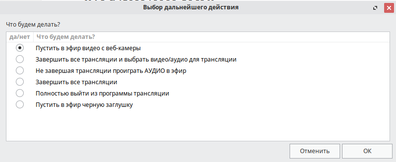
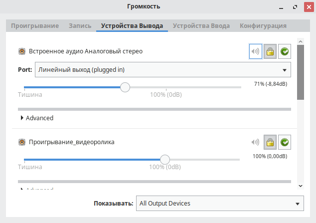
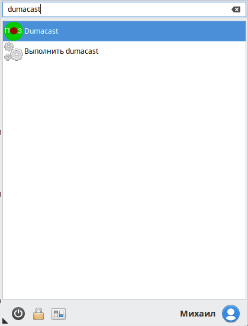

# Dumacast / Думакаст
(for English see bellow) README будет дополняться!

## Что это?
**Dumacast (Думакаст)** (ранее назывался dumalogiya-vwcm) — это скрипт и набор конфигурационных файлов, упаковываемых в deb пакет, в результате чего **создаются виртуальные микрофон и веб-камера**. В виртуальную веб-камеру транслируется картинка с настоящей веб-камеры, а, когда нужно, картинка из выбранного видеофайла. 

 

Звук из проигрываемого видео или аудио файла смешивается со звуком микрофона средствами PulseAudio. Графический интерфейс сделан на Zenity. Виртуальная веб-камера — неапстримный модуль ядра [v4l2loopback](https://github.com/umlaeute/v4l2loopback/). В качестве графического интерфейса для управления звуком (при необходимости) предлагается pavucontrol, автоматически запускаемый вместе с программой.

 

## Зачем это нужно?
На вебинарных площадках, в частности BigBlueButton, транслировать заранее записанные видео (например, мультфильмы на онлайн занятиях с детьми в школе эффективногом мышления «[Думалогия](http://думалогия.рф/)», для чего эта программа и была разработана и успешно применяется). 
Для многих применений можно считать заменой ManyCam для Linux.

После установки требуется ручное задание: 
— настоящей (не виртуальной) веб-камеры  
— устройства ввода звука, т.е. микрофона, узнается командой *pactl list sources*  
— устройства вывода звука, узнается командой *pactl list sinks*  

## Функции меню графического интерфейса:
1) копирование в виртуальную веб-камеру картинки с настоящей веб-камеры; это начинает делаться автоматически при запуске программы 
2) выбор видеофайла, остановка всех остальных трансляций и запуск в эфир выбранного видеофайла 
3) запуск аудио в эфир; открывается графическое окно ffplay, остановка проигрывания производится закрытием этого окна; аудио может проигрываться параллельно любым другим трансляциям 
4) завершение всех трансляций (на текущий момент кроме аудио, возможно, в будущем изменим это) 
5) завершение всех трансляций и закрытие dumacast 
6) черная заглушка — это файл /etc/dumalogiya/empty.mp4; если в виртуальную веб-камеру сначала транслировать видео с одним разрешением, а затем с другим, с другим соотношением сторон, то останется незанятая область, которая будет моргать последним кадром из предыдущей трансляции (не знаю, чей это баг). 
Поэтому на пару секунд пускаем полностью черное видео, а уже после него любое другое видео.

## Структура конфигов следующая:
/etc/dumalogiya/dumacast-config.sh ­— общесистемный конфиг  
При первом запуске программы создается папка $HOME/.config/dumacast/, куда копируется этот конфиг, а затем его можно редактировать без root-прав. 
При запуске программы конфиги подгружаются в следующем порядке: 
1) /etc/dumalogiya/dumacast-config.sh 
2) ~/.config/dumacast/dumacast-config.sh 
3) /etc/dumalogiya/dumacast-config-overrides.sh 
Каждый конфиг — это просто набор значений переменных bash. Соответственно, если в последующем конфиге повторяются переменные из предыдущих, то их значения перезаписываются последними. 
/etc/dumalogiya/dumacast-config-overrides.sh по умолчанию пустой, но он предусмотрен для случаев, когда путем обновления пакета понадобится внести какие-то важные изменения в настройки, которые должны будут перезаписывать конфиг пользователя.

Таким образом, есть 2 пути настройки программы: 
1-ый вариант: сделать холостой первый запуск и далее редактировать ~/.config/dumacast/dumacast-config.sh  
2-ой вариант: отредактировать /etc/dumalogiya/dumacast-config.sh , а при первом запуске в пространстве пользователя будет создана его копия.

 

## Как установить?
Скачайте и установите deb-пакет из раздела [релизов](https://github.com/mikhailnov/dumacast/releases). 
Для RPM и иных систем можно вручную положить папки /etc и /usr из этого дерева исходников в корень системы, то есть выполнить такие команды: 
git clone https://github.com/mikhailnov/dumacast.git 
sudo cp -rv etc / 
sudo cp -rv usr / 

## Сборка deb-пакета
git clone https://github.com/mikhailnov/dumacast.git 
cd dumacast 
debuild 
Deb-пакет соберется в директории на уровень ниже.

## Участие в разработке
Любые предложения, замечания, баг-репорты и коммиты приветствуются. в том числе такие, которые помогут сделать программу более универсальной. Я собираю ее только в deb пакеты, доступные в разделе релизов (Releases), поскольку на наших машинах и машинах наших тренеров, где работает Думакаст, используется Ubuntu, в основной ветке кода есть папка debian с конфигами для сборке deb-пакета, если кто закоммитит RPM .spec, pkgbuild, ebuild, то будет очень неплохо.

## Планы по разработке
Перевести на английский язык (в т.ч. комментарии в коде) и вынести локализацию в отделньые файлы, чтобы сделать проект доступнее нерусскоязычным пользователям. 
Дописать README, сделать его понятнее (если есть идеи — присылайте коммиты).

## Контакты разработчика:
Михаил Новоселов 
mikhailnov@dumalogiya.ru 
[vk.com/mikhailnov](https://vk.com/mikhailnov)  

-------------------------------

## In English (this section is in development, contributions in English and other languages are welcomed)
dumacast (former dumalogiya-vwcm): script for virtualising webcam and microphone on Linux (as Manycam does)
After installation and the first run edit configs in /etc/dumalogiya/dumacast-config.sh and $HOME/.config/dumacast/dumacast-config.sh
Config variables from $HOME/.config/dumacast/ overwrite the ones from /etc/dumalogiya/dumacast-config.sh, but they are added to them.
